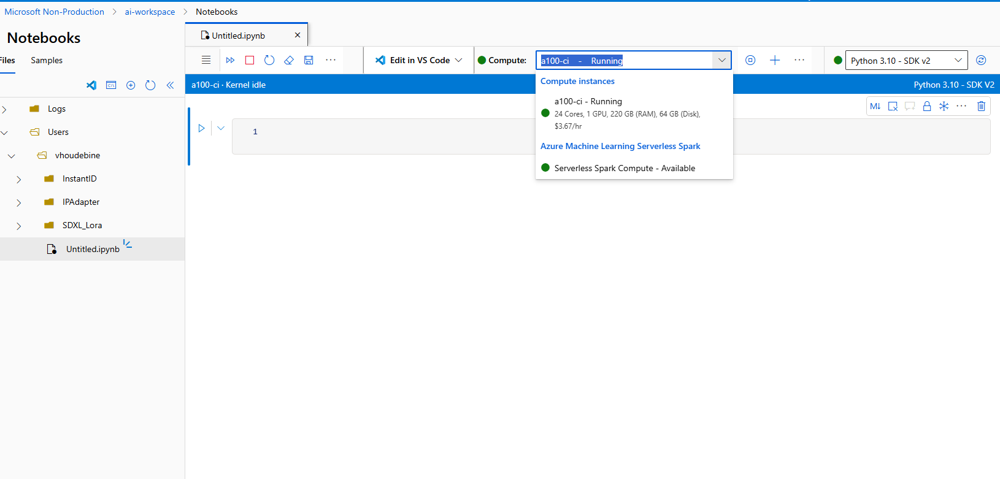
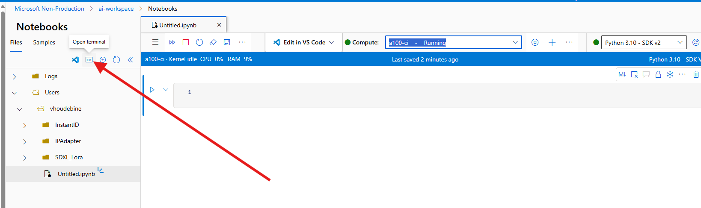

# Stable Diffusion image generation in Azure ML Notebooks

This repo shows how to run image generation using Stable Diffusion models in Azure Machine Learning notebooks.

## Objective: SDXL + IP Adapter for style transfer demo

IP-Adapter is an image prompt adapter that can be plugged into diffusion models to enable image prompting without any changes to the underlying model. Furthermore, this adapter can be reused with other models finetuned from the same base model and it can be combined with other adapters like ControlNet. The key idea behind IP-Adapter is the decoupled cross-attention mechanism which adds a separate cross-attention layer just for image features instead of using the same cross-attention layer for both text and image features. This allows the model to learn more image-specific features.

This repo walks through how to run a Stable Diffusion XL + IP Adpater pipeline in Azure Machine Learning for style transfer.

Read the [Diffusers documentation](https://huggingface.co/docs/diffusers/en/index) for tutorials and more generation techniques

## 0. Setting up the environment

### Pre-requisites
Install the Azure CLI (Install instructions [here](https://learn.microsoft.com/en-us/cli/azure/install-azure-cli)) and the ML extension (Install instructions [here](https://learn.microsoft.com/en-us/azure/machine-learning/how-to-configure-cli?view=azureml-api-2&tabs=public))

```shell
# The new Machine Learning extension requires Azure CLI version >=2.38.0. Ensure this requirement is met:
az version 
az extension list
az extension add -n ml
```
Once you’ve installed the CLI, it’s time to log into Azure and make sure the subscription you want to work with is set as default.

```shell
# Log in with your Azure account
az login

# Check existing accounts, look for the subscription you want to use
# (useful if you have access to several subscriptions)
az account list --output table

# Set your active subscription
az account set --subscription "<your-subscription-id>"

# Check the accounts list again, make sure that your subscription is active
# (IsDefault should be true)
az account list --output table
```

### Create the Azure resources 

To run the notebook in Azure Machine Learning, you'll need to create the following resources:
- A new resource group
- An Azure ML workspace
- A GPU compute instance

Define variables 
 ```python
    compute="gpu-ci"
    ml_workspace="ml-stable-diffusion"
    resource_group="rg-stable-diffusion"
    location="eastus"
 ```

#### Resource Group
```shell
az group create --name "${resource_group}" --location "${location}"
```

#### Azure ML workspace
```shell
az ml workspace create -n "${ml_workspace}" -g "${resource_group}"
```
Once the workspace is created, we'll need to create a compute instance to run our experiments on. The notebook was tested on the following SKU `Standard_NC24ads_A100_v4` but the Stable Diffusion models can run on smaller SKUs like `Standard_NC6s_v3`

#### GPU Compute instance

### Request quota for GPU VMs
Before creating the compute instance, you'll need to check whether you have enough GPU quota for the selected SKU. You can check quota by going to (https://ml.azure.com/quota)[https://ml.azure.com/quota]

If you don't have enough quota, you'll need to request it in the same region as your AML workspace. Click the “Request Quota” button and fill the support request.

### Create a compute Instance
Create a `compute.yaml` file describing the instance
```yaml
$schema: https://azuremlschemas.azureedge.net/latest/computeInstance.schema.json 

type: computeinstance

size: Standard_NC6s_v3
idle_time_before_shutdown: "PT30M"

schedules:
   compute_start_stop:
      - action: stop
        trigger:
         type: cron
         start_time: "2023-01-01T21:21:07"
         time_zone: UTC
         expression: 0 23 * * *

```

```shell
az ml compute create -f compute.yml -n "${compute}" -w "${ml_workspace}" -g "${resource_group}"
```
This can take a few minutes. Once the instance is created, it'll be available in AML Studio, in the Compute tab. 

### Install dependencies

Now we'll need to install the dependencies on the Compute Instance.
In Azure ML Studio, go to the Notebooks tab, create a Notebook and select your Compute Instance, start it.



To the top right, you can see the available kernels, we will create our own kernel with the dependencies from this repository.

Open up a terminal 



Clone this repository

```shell
git clone
cd azure-ml-stable-diffusion
```
Create new conda environment

```shell
conda create -n diffusers python=3.10 -y
conda activate diffusers
```

Install depencies

```shell
pip install -r requirements.txt
```

Now let's make sure this conda environment is available in the Notebook Kernel list, from the terminal run

```shell
conda install pip
conda install ipykernel
python -m ipykernel install --user --name diffusers --display-name "Python (diffusers)"
```

## 1. Run the notebook in Azure Machine Learning

Click on [ipadapter.ipynb](./ipadapter.ipynb), select the `Python (diffusers)` kernel and run through the cells. 